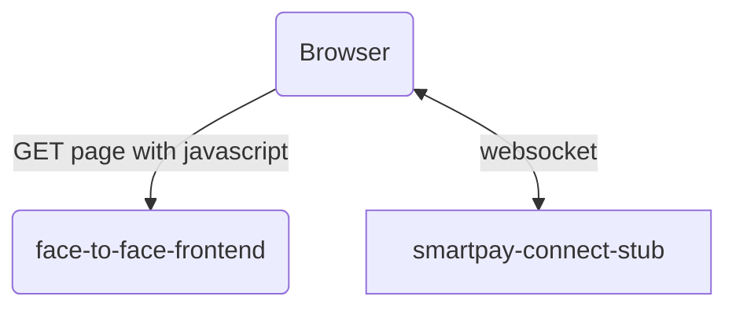
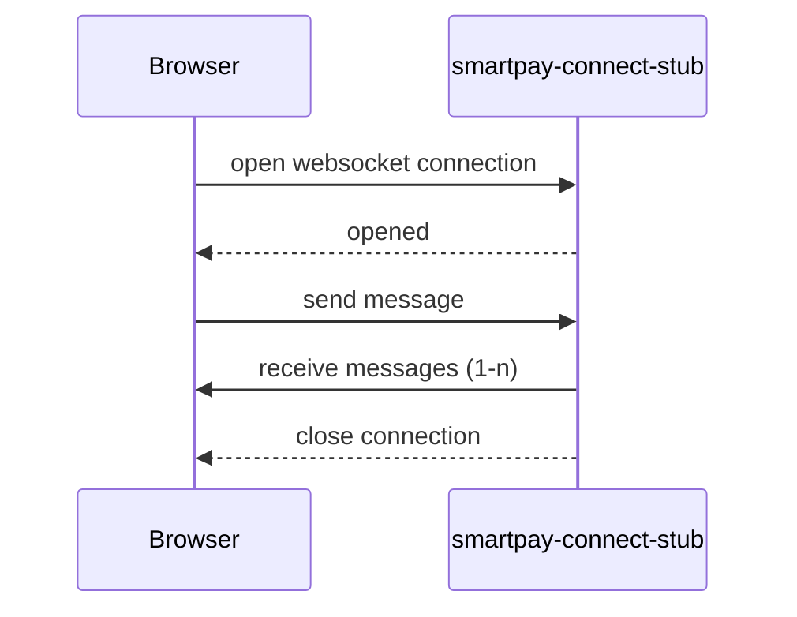

# About

The smartpay-connect-stub is a stub microservice used in F2F project. It emulates group of Barclaycard related systems involved in taking a card payment. Those are a _smartpay-connect-proxy_ and _smartpay-connect_ connected to the PED (Pin Enabled Device). This service emulates the user interaction with PED. Various scenarios can be choosen defining user behaviour for successfull and failed payments. 

# Websockets and MDTP

:shrug: Unfortunately because this service exposes a websocket endpoint it can't be deployd to MDTP platform. MDTP doesn't support such technology.
Therefore this service has to always run on developer's machine.

:exclamation: It has to also run locally when testing F2F on integrated environment (like Development, QA or Staging). 

At the moment only Development and Staging are configured to connect to this stub. This is done in _face-to-face-frontend_ microservice via setting `smartpayConnectUrl` [property](https://github.com/hmrc/face-to-face-frontend/blob/main/conf/application.conf#L119) pointing to production microservice or this stub.

# Architecture

A _browser_ get the page from _face-to-face-frontend_. This page runs javascript which calls a websocket on the stubs: 



The sequence diagram:


# How to run

## Using sbt

This can be run in a standard way:

```
sbt run
```

## Using service manager

To run the stub alone just call:

```
sm --start SMARTPAY_CONNECT_STUB 
```
In case of running all F2F services including this service there is a handy `F2F_ALL` profile:

```
sm --start F2F_ALL
```

# Scenario configuration

This service supports various payment scenarions.

1. Go to http://localhost:9263/smartpay-connect-stub/set-path-for-device
2. Select the scenario from the dropdown
3. Click submit
4. Start a face to face journey by going to http://localhost:9260/face-to-face/start

The default scenario is 'success with chip@pin'.
When you want to select a different path, you will need to set it each time by following the configuration steps above.

# Other documentation
* https://confluence.tools.tax.service.gov.uk/display/OPS/F2F+Payments
* https://confluence.tools.tax.service.gov.uk/display/Payments/Face+to+Face+Payments
* https://confluence.tools.tax.service.gov.uk/display/Payments/smartpay-connect-proxy
* https://confluence.tools.tax.service.gov.uk/pages/viewpage.action?pageId=457442181

### License

This code is open source software licensed under the [Apache 2.0 License]("http://www.apache.org/licenses/LICENSE-2.0.html").
