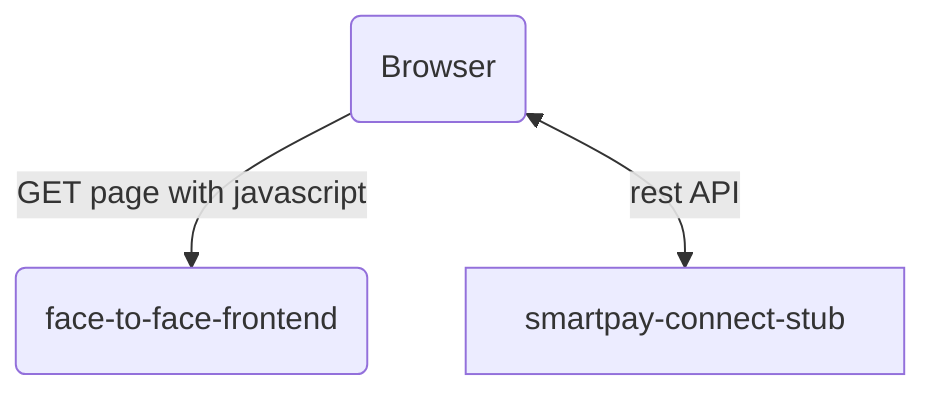
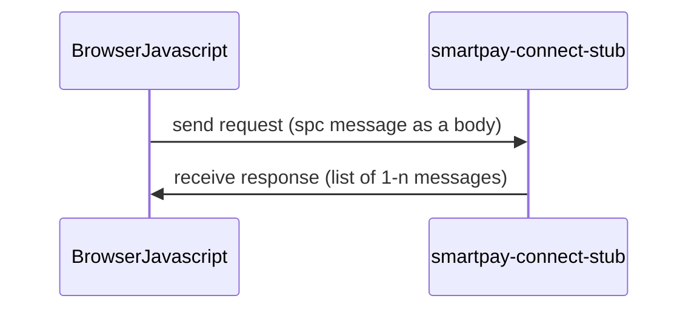

# About smartpay-connect-stub

The smartpay-connect-stub is a stub microservice used in the Face to Face (F2F) service.
It emulates a group of Barclaycard related systems involved in taking a card payment. Those are
_smartpay-connect-proxy_ and _smartpay-connect_, connected to a pin enabled device (PED). This service emulates the
user interaction with the PED. Various scenarios can be chosen, which define user behaviour for successful and
unsuccessful payments.

# Architecture

A _browser_ gets the page from _face-to-face-frontend_.
This page runs javascript which calls a websocket on the stubs:



The sequence diagram:



# How to run

## Using sbt

This can be run in a standard way:

```
sbt run
```

## Using service manager

To run the stub alone:

```
sm --start SMARTPAY_CONNECT_STUB
```

To run all F2F services including this service there is a `F2F_ALL` profile:

```
sm --start F2F_ALL
```

# Scenario configuration

This service supports various payment scenarios.

1. Go to http://localhost:9263
2. Select the scenario from the dropdown
3. Click submit
4. Start a face to face journey by going to http://localhost:9260/face-to-face/start

The default scenario is 'success with chip@pin'.
When you want to select a different path, you will need to set it each time by following the configuration steps above.

# Other documentation

* https://confluence.tools.tax.service.gov.uk/display/OPS/F2F+Payments
* https://confluence.tools.tax.service.gov.uk/display/Payments/Face+to+Face+Payments
* https://confluence.tools.tax.service.gov.uk/display/Payments/smartpay-connect-proxy
* https://confluence.tools.tax.service.gov.uk/pages/viewpage.action?pageId=457442181

### License

This code is open source software licensed under the [Apache 2.0 License]("http://www.apache.org/licenses/LICENSE-2.0.html").
